<div align="center">

<picture>
  <source media="(prefers-color-scheme: dark)" srcset="assets/banner-dark.svg">
  <source media="(prefers-color-scheme: light)" srcset="assets/banner-light.svg">
  
</picture>

<a href="https://git.io/typing-svg">
  
</a>

<br/>

<a href="#"></a>
<a href="#"></a>

<br/>

<a href="https://github.com/Naisah/Naisah/blob/main/resume.pdf"></a>
<a href="https://www.linkedin.com/in/naisahaspiras"></a>
<a href="mailto:naisahaspiras24@gmail.com"></a>
<a href="https://github.com/Naisah"></a>

</div>

<br/>

---

## About Me

Hi, I'm **Naisah** — a BS Information Technology student at **Mapúa University**, currently maintaining a **1.4 GWA** as a **Dean's Lister and President's Lister**.

I'm a **student developer** with my sights set on becoming a **Cloud Engineer** — learning by building real, working systems rather than just following tutorials.

- Working toward **Cloud Engineering**: studying GCP fundamentals, infrastructure basics, and cloud-based deployment through coursework and hands-on practice.
- Building a complementary specialization as an **AI Solutions Architect** — hands-on with LLM tooling, prompt engineering, and AI-assisted workflows through my internship at FlyRank AI.
- Comfortable across the stack — from **frontend interfaces** to **backend logic and databases**.
- Outside of code: I run on **hojicha** and spend my weekends **cafe-hopping** around the city.
- Reach me at: **naisahaspiras24@gmail.com**

<br/>

**Open To:**

```yaml
aspiring_role: Cloud Engineer
learning:      [Cloud Computing (GCP), AI Solutions Architecture, System Design]
building:      [Full Stack Web Apps, AI-assisted Tools, Blockchain Experiments]
open_to:       [Internships, Student Collaborations, Hackathons, Open Source]
fueled_by:     [Hojicha, Indie Playlists, Curiosity]
```

<br/>

---

## My Litter of Tools

<div align="center">

**Languages**


<br/><br/>

**Frontend**


<br/><br/>

**Backend & Databases**


<br/><br/>

**Cloud, DevOps & Tooling**


<br/><br/>

**AI Tools**


<br/><br/>

**Exploring**


</div>

---

## Contribution Snake

<div align="center">


</div>

<br/>

---

## Connect With Me

<div align="center">

<a href="mailto:naisahaspiras24@gmail.com"></a>
<a href="https://www.linkedin.com/in/naisahaspiras"></a>
<a href="https://github.com/Naisah"></a>

</div>

<br/>

---

<div align="center">

*"Still learning the cloud, still perfecting my hojicha order — one commit at a time."*


<sub style="font-size:15px;">thanks for stopping by, now feed the cat 🐱</sub>

</div>
